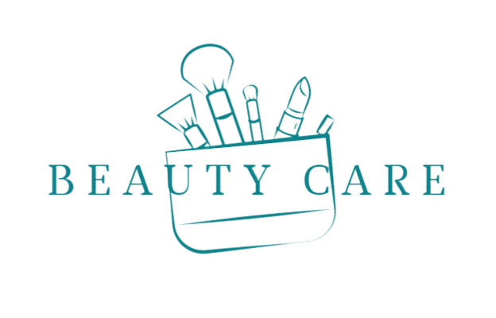

# Project5 - Beauty-Care WebSite
## Group Members  {**Ghufran Al-Momani**, **Ro'a Yaseen**, **Sara Kteifan**, **Saja Al-Ghalayini**, **Bahaa Al-deen**}

***
## Introduction
After We Learn Set of Topics Like:

1. UI/Ux
1. HTML5
1. CSS3
1. PHP
1. BOOTSTRAP
1. Git
1. MySQL

WE DO IT!

Create Our Ecommerce WebSite

## Project Overview

We have created a Ecommerce website, specialize in cosmetic the customer can explore product and put it in his cart if he login and edit it finally checkout his order, the web site has admin dashboard Admin can Add, Edit, Remove and View (Products, users, catagories, sales).

## Project Design

1. Project Wireframe & Mockup
   * [UI Link](https://www.figma.com/file/E0fWyZMNC0X8CYNKNO6BAO/Project-5?node-id=0%3A1)

1. Project Repo
   * [Repo Link](https://github.com/bahaa12edeen/cosmetics5)